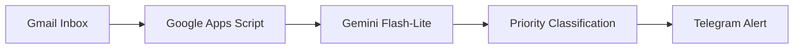
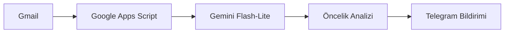

# 🛡️ AI-Email-Guardian

> **Built to make sure I never miss an API change, Play Console warning, or internship interview email again.**
>
> **API değişikliklerini, Play Console uyarılarını ve staj görüşmesi davetlerini kaçırmamak için geliştirdiğim yapay zekâ destekli e-posta asistanı.**

**AI-powered Gmail filter that detects critical emails and instantly forwards them to Telegram.**

Built as a Computer Engineering student to stay focused on development and university work without constantly checking emails.

---

## 🚀 Features

* 100% Serverless Architecture (Google Apps Script)
* AI-powered email classification with Gemini Flash-Lite
* Instant Telegram notifications
* Fail-safe processing to prevent missed emails
* Secure credential management via PropertiesService

### Detects emails such as

* Internship interview invitations
* Google Play Console warnings
* API deprecation notices
* Account and billing alerts
* Service disruption notifications
* Other high-priority emails requiring immediate attention

---

## 🏗️ Architecture

---

## ⚙️ Tech Stack

**Backend:** Google Apps Script

**AI:** Gemini Flash-Lite

**Notifications:** Telegram Bot API

**Storage:** Google PropertiesService

---

## 💡 Why I Built This

As a Computer Engineering student and Android developer, I often spend long hours coding, studying, and working on personal projects.

Important emails such as internship interview invitations, Play Console warnings, or API change notifications can easily get buried among less important messages.

AI-Email-Guardian acts as a personal assistant that continuously monitors incoming emails and immediately notifies me when something requires attention.

---

# 🇹🇷 Türkçe

**Kritik e-postaları tespit edip anında Telegram'a ileten yapay zekâ destekli Gmail filtresi.**

Bilgisayar Mühendisliği öğrencisi olarak, geliştirme süreçlerine ve derslere odaklanabilmek için sürekli e-posta kontrol etme ihtiyacını ortadan kaldırmak amacıyla geliştirildi.

---

## 🚀 Özellikler

* %100 Sunucusuz Mimari (Google Apps Script)
* Gemini Flash-Lite ile Akıllı Mail Analizi
* Anlık Telegram Bildirimleri
* Veri Kaybını Önleyen Fail-Safe Yapı
* PropertiesService ile Güvenli Anahtar Yönetimi

### Algılanabilen e-postalar

* Staj görüşmesi davetleri
* Google Play Console uyarıları
* API değişiklik bildirimleri
* Hesap ve ödeme uyarıları
* Servis kesintisi bildirimleri
* Acil müdahale gerektiren diğer kritik e-postalar

---

## 🏗️ Mimari

---

## ⚙️ Teknolojiler

**Backend:** Google Apps Script

**Yapay Zekâ:** Gemini Flash-Lite

**Bildirim:** Telegram Bot API

**Depolama:** Google PropertiesService

---

## 💡 Neden Geliştirildi?

Yazılım geliştirme, dersler ve kişisel projeler arasında çalışırken önemli e-postaların gözden kaçması oldukça kolaydır.

Özellikle staj görüşmeleri, Play Console uyarıları veya API değişiklikleri gibi kritik bildirimlerin zamanında fark edilmesi gerekir.

AI-Email-Guardian, gelen kutusunu sürekli takip ederek önemli e-postaları analiz eder ve anında Telegram üzerinden bildirir.
